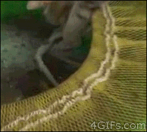
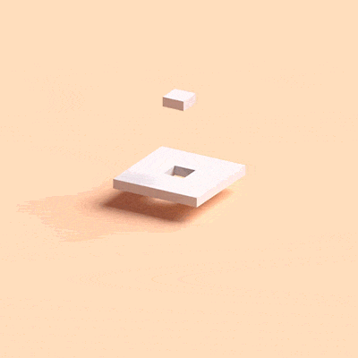
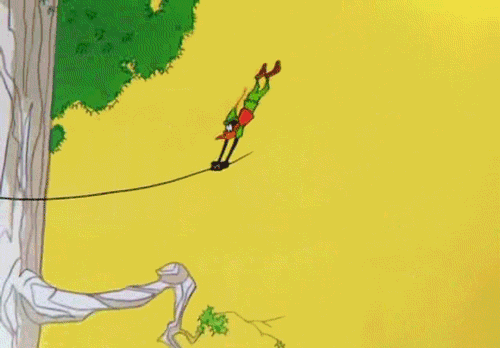
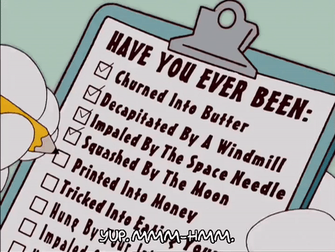
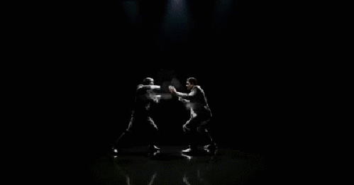
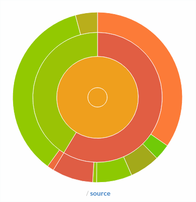
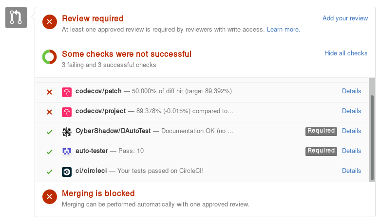

# __Harden__
<!-- .element: class="raw" style="height: 40%; width: auto; opacity: 0.7;" -->
# your `<code/>`


## Disclaimer

- __High level__ concepts
- Can be applied to:
    + __Any language__
    + __Any target__ (native app, web, embedded...)

- Always __good__ <ico>😉</ico>


## __Q__uality __A__ssurance

- Some people are payed to do only this
- Worst job ever?


## Have you ever met...


### A bugfix introducing a new bug
<!-- .element: class="raw full-height" -->


### Unexpected side effects
<!-- .element: class="full-height" -->


### Regressions
<!-- .element: class="full-height" -->


### Unexpected inputs
<!-- .element: class="full-height" -->

Note: Documentation is never perfect, devs can't be always smart
- Null / Nil
- Negative, very high/long value
- Unexpected character in string


## Uncertain edge cases

What if...
- Access denied
- Electromagnetic perturbations
- Ethernet cable is cut
- You run out of RAM
- ...

Note: You need to be informed when & where it occurs, and handle it


## True story: LCDA

- __~300K__ lines of code, tied to runtime server state
- Lot of __adds and patches__ from many __non professional devs__
- One minor change ~~may~~ __will probably__ break everything
- _We suffer from constant regressions_ <ico>😵</ico>


## True story: Costof2

- Software was written by __skilled devs__
- __Embedded__ targets makes testing slow
- No segfaults checks
- _We fear regressions and memory safety issues_ <ico>😨</ico>


## Fear ! <!-- .element: style="height: 4rem; width: auto; vertical-align: middle; transform: rotate(-20deg); opacity: 0.8;" -->

- Fixing bugs is a __waste of time__, and __introduces new bugs__
- __Regressions__ are god damn __frustrating__
- We can't predict __how users will use__ our code
- You __WILL__ break your code, and may not see it


## Development hurts...
<!-- .element: class="full-height" -->

_but we like it_


## Time to move forward !
<!-- .element: class="full-height" style="transform: scaleX(-1);" -->

------------------------------------------------------------
<!-- .slide: data-background="#003367" -->

# __Unittests__


## May seems annoying
<!-- .element: class="full-height" -->


## In fact
```c
int main(){
    printf("%s\n", my_function(42, 1337));
    printf("===> %s\n", my_function(-1, 0));
}
```
- You're doing _manual_ unittests very often
- This work shouldn't be wasted


## The ugly <ico>😢</ico>

- Write test cases on paper/word/...
- Start writing unittests after writing code


## The bad <ico>😡</ico>

- Think that unittests will slow you down
- Test some functions with typical values


## The good <ico>😻</ico>

0. Write some unittests before implementation
0. Write unittests for each function/file
0. During implementation, add as many tests as possible


## Keep in mind

### Writing unittest __IS development__

### It helps you write __better code, faster__


## Unittests as __documentation__
<!-- .element: class="full-height" -->


## What does it do?

```c
/// @brief resolve issue #666
/// @param str input data
int do_some_magic(char *str) {
  int res = 0;
  int pol = 1;
  str--;
  while (*(++str) != 0) {
    if (*str == ' ' || (*str >= 0x09 && *str <= 0x0D)) continue;
    else if (*str == '-') pol = -1;
    else if (*str >= 0x30 && *str <= 0x39)
      res = res * 10 + (*str - 0x30);
    else return 0;
  }
  return pol * res;
}
```


## Now you know
```c
void do_some_magic_unittests(){
    assert(do_some_magic("10") == 10);
    assert(do_some_magic("-42") == -42);
    assert(do_some_magic("  - 5 2") == -52);
    assert(do_some_magic(" \t 1337  \t") == 1337);
    assert(do_some_magic("asdf") == 0);
    assert(do_some_magic("123 456 fa") == 0);
}
```

------------------------------------------------------------
<!-- .slide: data-background="#003367" -->
# __Coverage__ analysis


## Why
Are you sure you tested everything?

<!-- .element: class="full-height" -->


### Example: GCC
```c
#include <stdio.h>
void leet_enc(const char* s){
    while(*s != '\0'){
        switch(*s){
            case 'O': printf("0"); break;
            case 'E': printf("3"); break;
            case 'T': printf("7"); break;
            case 'I': printf("1"); break;
            default: printf("%c", *s); break;
        }
        s++;
    }
}
int main(){
    leet_enc("HELLO WORLD\n");
    leet_enc("");
    return 0;
}
```


## Build for coverage
```sh
gcc -ftest-coverage -fprofile-arcs test.c -o test
./test
# H3LL0 W0RLD
gcov test.c
# File 'test.c'
# Lines executed:85.71% of 14
# Creating 'test.c.gcov'
```


## Output
```c
    -:    0:Source:test.c
    -:    0:Graph:test.gcno
    -:    0:Data:test.gcda
    -:    0:Runs:1
    -:    0:Programs:1
    -:    1:#include <stdio.h>
    2:    2:void leet_enc(const char* s){
   16:    3:    while(*s != '\0'){
   12:    4:        switch(*s){
    2:    5:            case 'O': printf("0"); break;
    1:    6:            case 'E': printf("3"); break;
#####:    7:            case 'T': printf("7"); break;
#####:    8:            case 'I': printf("1"); break;
    9:    9:            default: printf("%c", *s); break;
    -:   10:        }
   12:   11:        s++;
    -:   12:    }
    2:   13:}
    1:   14:int main(){
    1:   15:    leet_enc("HELLO WORLD\n");
    1:   16:    leet_enc("");
    1:   17:    return 0;
    -:   18:}
```

------------------------------------------------------------
<!-- .slide: data-background="#003367" -->
# __Contract__ programming


## In/Out contract
```c
double approx_sin(double angle){
  // IN Check
  assert(-PI <= angle && angle <= PI);//Fail if given degrees

  double res = angle
               - pow(angle, 3) / fact(3) 
               + pow(angle, 5) / fact(5)
               - pow(angle, 7) / fact(7);

  // OUT check
  assert(-1.0 <= res && res <= 1.0);
  return res;
}
```


## Native support

Dlang, C++17, ...

```d
// D
double approx_sin(double angle)
in{
    assert(-PI <= angle && angle <= PI);
}
out(res){
    assert(-1.0 <= res && res <= 1.0);
}
body{
    //...
}
```


## Remember
- Only checks
- No side effects
- Do not change the function behaviour


## Invariant (Typestate?)

Native in D, Eiffel, soon in C++17

```d
// D
class GpsCoord{
    double lat;
    double lon;

    invariant{
        //This code is not allowed to modify object
        assert(-90.0 <= lat && lat <= 90.0);
        assert(-180.0 <= lon && lon <= 180.0);
    }
};
```

------------------------------------------------------------
<!-- .slide: data-background="#003367" -->
# __C__ontinuous __I__ntegration


## What if...

- You forgot to run unittests
- An evil guy breaks unittests, and don't notice
- You don't want to double check every modification


## Executing unittests is __boooooooooooooring__

...and I'm lazy


## Here comes automation!

<!-- .element: class="full-height" -->


## TravisCI (GitHub)

`.travis.yml`
```yml
language: c
script:
  - clang -coverage -O0 hello.c -o hello
  - ./hello
  - gcov hello.c
```


## Others

- GitlabCI
- Jenkins
- DroneIO
- Codeship
- ...


## codecov

Coverage Analysis




## Be proud !

### `github.com/CromFr/nwn-lib-d`

[<!-- .element: class="raw" style="width: 30%" -->](https://travis-ci.org/CromFr/nwn-lib-d)

[<!-- .element: class="raw" style="width: 30%" -->](https://codecov.io/gh/CromFr/nwn-lib-d)


## Open source usage

- Check merge requests
- Enforce coding style
- Prevent people from breaking anything<br/>(without getting blamed)


## dlang/phobos

<!-- .element: class="full-width" -->

------------------------------------------------------------
<!-- .slide: data-background="#003367" -->

# Bonus stage
<!-- .element: class="raw full-height" -->


#### `less_code && less_copy_paste == better_code`


## The compiler is your friend


## Assertion vs Exception


## Mock objects / Stub

- Email sender example

- Mock = fake object for assert purposes
- Stub = fake object to be able to run tests


## Code formatting

- gofmt
- clang-format
- dfmt
- ...

------------------------------------------------------------
<!-- .slide: data-background="#003367" -->

# (?)
<!-- .element: class="full-height" -->
