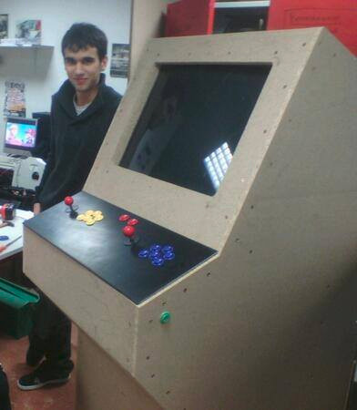

## __Harden__
<!-- .element: class="raw" style="height: 200px; width: auto; opacity: 0.7;" -->
## your `<code/>`


------------------------------------------------------------


## about::me

<table>
    <tr>
        <td style="vertical-align: top;">
            <p>Thibaut CHARLES</p>
            <ul>
                <li>https://thibautcharles.net</li>
                <li>@CromFr <a href="https://twitter.com/@CromFr">Twitter</a>/<a href="https://github.com/CromFr/">Github</a></li>
                <li>CromFr@gmail.com</li>
                <li>ClubElec before it was cool (2011)</li>
            </ul>
        </td>
        <td>
            <!-- .element: class="h400" -->
        </td>
    </tr>
</table>


## Yay ! <!-- .element: style="font-family: comic sans ms;" -->


## about::this

Notes:
- Used everywhere (enterprise & open source)
- Useful for you
- Not taught at school


------------------------------------------------------------


## Disclaimer

- __High level__ concepts
- Can be applied to:
  + __Any language__
  + __Any target__ (native app, web, embedded...)
- Useful for __small__ to __big__ projects
- Always __good__ <ico>😉</ico>

Note: I'll give key words


## Have you ever met...


### A bugfix introducing a new bug
<!-- .element: class="raw h400" -->


### Unexpected side effects
<!-- .element: class="h400" -->


### Regressions
<!-- .element: class="h400" -->


### Unexpected inputs
<!-- .element: class="h400" -->

Note: Documentation is never perfect, devs can't be always smart
- Null / Nil
- Negative, very high/long value
- Unexpected character in string


## Software is fragile
<object id="dependencygraph" data="res/dependencygraph.svg" type="image/svg+xml" onload="dependencygraph_load()"><!-- .element: class="raw h500" -->
<span id="dependencygraph1" class="fragment"></span>
<span id="dependencygraph2" class="fragment"></span>
<span id="dependencygraph3" class="fragment"></span>
<span id="dependencygraph4" class="fragment"></span>
<span id="dependencygraph5" class="fragment"></span>
<span id="dependencygraph6" class="fragment"></span>
<span id="dependencygraph7" class="fragment"></span>
<span id="dependencygraph8" class="fragment"></span>
<span id="dependencygraph9" class="fragment"></span>


## Uncertain edge cases

What if...
- Access denied
- Electromagnetic perturbations
- Ethernet cable is cut
- You run out of RAM
- ...

Note: You need to be informed when & where it occurs, and handle it


## True story: LCDA

- __~300K__ lines of code, tied to runtime server state
- Lot of __adds and patches__ from many __non professional devs__
- One minor change ~~may~~ __will probably__ break everything
- _We suffer from constant regressions_ <ico>😵</ico>


## True story: Costof2

- Software was written by __skilled devs__
- __Embedded__ targets makes testing slow
- No segfaults checks
- _We fear regressions and memory safety issues_ <ico>😨</ico>


## Fear ! <!-- .element: style="height: 4rem; width: auto; vertical-align: middle; transform: rotate(-20deg); opacity: 0.8;" -->

- Fixing bugs is a __waste of time__, and __introduces new bugs__
- __Regressions__ are god damn __frustrating__
- We can't predict __how users will use__ our code
- You __WILL__ break your code, and may not see it


## Fear-based programming
Don't touch it, it's fragile !


## Time wasted
<object id="linesofcodetimespent" data="res/linesofcodetimespent.svg" type="image/svg+xml" onload="linesofcodetimespent_load()"><!-- .element: class="raw h500" -->
<span id="linesofcodetimespent1" class="fragment"></span>
<span id="linesofcodetimespent2" class="fragment"></span>
<span id="linesofcodetimespent3" class="fragment"></span>
<span id="linesofcodetimespent4" class="fragment"></span>
<span id="linesofcodetimespent5" class="fragment"></span>


## __Q__uality __A__ssurance

- Keep things easy

- Some people are paid to do only this
- Worst job ever?


## Development hurts...
<!-- .element: class="h300" -->

_but we like it_


## Time to move forward !
<!-- .element: class="h400" style="transform: scaleX(-1);" -->


------------------------------------------------------------


# __Unit tests__
<!-- .slide: data-background="#421c0d" -->


## Unit testing

- __Execute__ things, __check__ results
- __List__ of tests with their results


#

|                      Test                     |   Result  |
| --------------------------------------------- | --------- |
| Execute on PC with GPS connected              | ok        |
| => Disconnect the GPS                         | __crash__ |
| Execute on PC with GPS disconnected           | ok        |
| => Connect the GPS                            | ok        |
| => Disconnect the GPS                         | __crash__ |
| Execute on Raspberry Pi with GPS connected    | ok        |
| => Disconnect the GPS                         | ok        |
| Execute on Raspberry Pi with GPS disconnected | __crash__ |
| ...                                           |           |
<!-- .element: style="font-size: 0.8em" -->


## How do you like this?
<!-- .element: class="h400" -->

Notes:
- Waste of time, annoying as sh***
- This works for things that never change (measurements)


## In fact
```c
int main(){
    printf("%s\n", my_function(42, 1337));
    printf("===> %s\n", my_function(-1, 0));
}
```
- You're doing these kind of tests very often
- This work shouldn't be wasted


## HowTo test


## Assertions

```c
assert(1 != 0);
```

```raw
helloworld: main.c:42: main: Assertion `1 != 0' failed
[1]    27988 abort (core dumped)  ./helloworld
```

Notes:
- Who encountered, used assertions?
- assert is for checking development issues


## The ugly way

- Write test cases on paper/word/...
- Start writing tests after writing your program
- Remove tests once it works


## The bad way

- Think that writing unit tests will slow you down
- Write 1/2/3/... tests to check a function


## The good way

0. Write some unit tests __before implementation__
0. Write unit tests __for each__ function/file
0. During __implementation__, __reinforce__ your tests
0. Unit tests must be __independents__

Note: independent = no side effects, like singletons instantiation


## TDD
Test-Driven Development


## Before implementation
```c
void car_t_unittests(){
  struct car_t* car = car_new(2, 5);//2 roues mot. 5 portes
  assert(car->gaz == 40);//Réservoir plein
  assert(car_move_km(car, 300) == 300);//on se déplace de 300km
  assert(car->gaz == 10);//Il reste 10 L
  assert(car_move_km(car, 200) == 100);//Panne au bout de 100km
  assert(car_fill_gaz(car, 20));//On met 20L dans la voiture
  assert(car->gaz == 20);//Il y a 20L
}
```
Helps you setup a __clean API__


## For each function/file
```d
//D
class GpsPoint{
  double lat, lon;
  void setDMS(string value){
    // Set lat, lon using degrees/minutes/seconds notation
  }
  unittest{ //Tests for setDMS
    auto p = new GpsPoint();
    p.setDMS("48°24'25.1886\",-4°29'44.4084\"");
    assert(p.lat == 48.406997 && p.lon == -4.4956687);
  }
}
unittest{ //Tests for GpsPoint
    auto a = new GpsPoint(48.0, -4.4);
    a.goForward(90.0, 100);
    a.inverseNorthSouth();
    assert(p.lat == xxx && p.lon == xxx);
}
```
Just make sure __everything__ has its own unit tests.


### During implementation
## __reinforce__

- You know how it's __implemented__
- You know which cases are __tricky__
- Don't forget to add __more/better tests__

Note: don't avoid tricky tests or they will hit you in the face


## Independent unit tests
- One test __must not affect another__ test
- Avoid __non-pure__
  + Global variables
  + Singleton classes
  + I/O operation that are not dedicated to unit tests
    * File writing
    * Send persistent data to web servers
    * ...


## Keep in mind

- Writing unit test __IS development__
- It helps you write __better code, faster__


## Unit tests as ... __documentation__
<!-- .element: class="h400" -->

Note: next is a tricky code example


## What does it do?

```c
/// @brief resolve bug #666
/// @param size Number of magic bytes
int do_some_magic(char *str) {
  int res = 0;
  int pol = 1;
  str--;
  while (*(++str) != 0) {
    if (*str == ' ' || (*str >= 0x09 && *str <= 0x0D)) continue;
    else if (*str == '-') pol = -1;
    else if (*str >= 0x30 && *str <= 0x39)
      res = res * 10 + (*str - 0x30);
    else return 0;
  }
  return pol * res;
}
```


## Now you know
```c
void do_some_magic_unittests(){
    assert(do_some_magic("10") == 10);
    assert(do_some_magic("-42") == -42);
    assert(do_some_magic("  - 5 2") == -52);
    assert(do_some_magic(" \t 1337  \t") == 1337);
    assert(do_some_magic("asdf") == 0);
    assert(do_some_magic("a123 456") == 0);
}
```


## But... please...

Don't be a freak, be efficient

<!-- .element: class="h300" -->

Note:
- No need to write 10 lines for every function on earth
- You can test called functions by testing the caller
- You'll learn efficient unit testing with time
- Library functions should not be unit tested


------------------------------------------------------------

# __Coverage__ analysis
<!-- .slide: data-background="#421c0d" -->


## What?
- A __way to build/execute__ the program
- Provided by __language tooling__
- __Count__ each line __execution__


## Why?
Are you sure you tested everything?
<!-- .element: class="h400" -->


## Example: GCC
```c
char* leet_enc(char* s){
    char* ret = malloc(strlen(s)); strcpy(ret, s);
    char* iter = ret;
    while(*iter++ != '\0'){
        switch(*iter){
            case 'O': *iter = '0'; break;
            case 'E': *iter = '3'; break;
            case 'T': *iter = '7'; break;
            case 'I': *iter = '1'; break;
            default: break;
        }
    }
    return ret;
}
int main(){
    assert(strcmp(leet_enc("HELLO WORLD\n"), "H3LL0 W0RLD\n") == 0);
    assert(strcmp(leet_enc(""), "") == 0);
    return 0;
}
```


## Build for coverage
```sh
gcc -ftest-coverage -fprofile-arcs test.c -o test
./test
gcov test.c
# File 'test.c'
# Lines executed:86.67% of 15
# Creating 'test.c.gcov'
```


## Output
```c
        2:    5:char* leet_enc(char* s){
        2:    6:    char* ret = malloc(strlen(s)); strcpy(ret, s);
        2:    7:    char* iter = ret;
       16:    8:    while(*iter++ != '\0'){
       12:    9:        switch(*iter){
        2:   10:            case 'O': *iter = '0'; break;
        1:   11:            case 'E': *iter = '3'; break;
    #####:   12:            case 'T': *iter = '7'; break;
    #####:   13:            case 'I': *iter = '1'; break;
        9:   14:            default: break;
        -:   15:        }
        -:   16:    }
        2:   17:    return ret;
        -:   18:}
        1:   19:int main(){
        1:   20:    assert(strcmp(leet_enc("HELLO WORLD\n"), "H3LL0 W0RLD\n") == 0);
        1:   21:    assert(strcmp(leet_enc(""), "") == 0);
        1:   22:    return 0;
        -:   23:}
```
<!-- .element: class="h500" --><span class="fragment">TODO: Test strings with `T` and `I`</span>


Note: `| Exec count | Line No | Code |`


## Advice

Don't fake your ratio<br/>
by calling functions without checks

<!-- .element: class="h300" -->


------------------------------------------------------------

# __Contract__ programing
<!-- .slide: data-background="#421c0d" -->


## Why?
- A way to __check__ functions
  + Input (parameters)
  + Output (return values)
  + Each time they are called
  + Without side effects


## In/Out contract
```c
double approx_sin(double angle){
  // IN Check
  assert(-PI <= angle && angle <= PI);//Fail if given degrees

  double res = angle
               - pow(angle, 3) / fact(3) 
               + pow(angle, 5) / fact(5)
               - pow(angle, 7) / fact(7);

  // OUT check
  assert(-1.0 <= res && res <= 1.0);
  return res;
}
```


## Native support

Dlang, C++17, ...

```d
// D
double approx_sin(double angle)
in{
    assert(-PI <= angle && angle <= PI);
}
out(res){
    assert(-1.0 <= res && res <= 1.0);
}
body{
    //...
}
```


## Remember
- __Only checks__
- __No side effects__
- __Do not change__ the function __behaviour__


## Invariant

Native in D, Eiffel, soon in C++17

```d
// D
class GpsCoord{
    double lat;
    double lon;

    invariant{
        //This code is not allowed to modify object
        assert(-90.0 <= lat && lat <= 90.0);
        assert(-180.0 <= lon && lon <= 180.0);
    }
};
```


------------------------------------------------------------

# __C__ontinuous __I__ntegration
<!-- .slide: data-background="#421c0d" -->


## What if...

- You __forgot__ to run unit tests
- An __evil guy breaks the code__, without noticing
- You __don't want to double check__ every modification


## Executing unit tests is __boooooooooooooring__

...and I'm lazy

<!-- .element: class="raw h300" -->


## Here comes automation!

<!-- .element: class="h400" -->


## Do
- __Execute__ unit tests
- __Analyze__ coverage
- __Generate__ documentation
- Do some __magic__
- ...

For __each__ modification


## TravisCI (GitHub)

`.travis.yml`
```yml
language: c
script:
  - clang -coverage -O0 hello.c -o hello
  - ./hello
  - gcov hello.c
```


## Others

- GitlabCI
- Jenkins
- DroneIO
- Codeship
- ...


## codecov

Coverage Analysis


## Be proud !

#### `github.com/CromFr/nwn-lib-d`

[<!-- .element: class="raw" style="width: 30%" -->](https://travis-ci.org/CromFr/nwn-lib-d)

[<!-- .element: class="raw" style="width: 30%" -->](https://codecov.io/gh/CromFr/nwn-lib-d)


## Open source usage

- Check __merge/pull requests__
- Enforce __coding style__, __coverage__ quality
- __Prevent__ people from __breaking__ anything<br/>(without getting blamed)
- Build, test, __deploy__ from a __trusted__ environment


## dlang/phobos

<!-- .element: class="h500" -->


## Process
<object id="opensourceci" data="res/opensourceci.svg" type="image/svg+xml" onload="opensourceci_load()"><!-- .element: class="raw h500" -->
<span id="opensourceci1" class="fragment"></span>
<span id="opensourceci2" class="fragment"></span>
<span id="opensourceci3" class="fragment"></span>
<span id="opensourceci4" class="fragment"></span>
<span id="opensourceci5" class="fragment"></span>
<span id="opensourceci6" class="fragment"></span>


------------------------------------------------------------


# Bonus stage
<!-- .element: class="raw h400" -->
<footer>ExtraCredits</footer>
<!-- .slide: data-background="#421c0d" -->


## Handling inter-dependencies

- Mock / Stub functions / class
  + __Stub__ = to be able to build tests
  + __Mock__ = to run & do test assertions


## Exception vs Assertion

- __Exceptions__ are for:
  + Errors that are created by the __user__
  + Ex: Access denied, Malformed XML
- __Assertions__
  + A __debugging__ tool
  + If it happens, it's the __developer's fault__
  + ex: Division by 0, Pointer errors


## The compiler is your best friend

...or a powerful linter

Notes: 
- Keep warnings
- Rust's ownership tested at CT


## Static / dynamic analysis
- Static
  * __cppcheck__
  * FindBugs (Java)
- Dynamic 
  * __valgrind__

Note: static analysis similar to compiler warnings


## Fuzzing the beast
- Test your code with randomized inputs
- Wait for your program to:
  + Crash
  + Do weird things
  + ...

Note: Used in security area


#### `less_code && less_duplications`
#### `==`
#### `better_code`


## Peer working<br/>=> Code formatting

- gofmt
- clang-format
- dfmt
- rustfmt
- ...


## Profile-guided optimizations

- Optimize code for __specific use cases__
  + Statistical analysis
  + Code instrumentation
- Unit tests can __automate__ these use cases


------------------------------------------------------------

# (?)
<!-- .element: class="h400" -->
<footer>ExtraCredits</footer>

<!-- .slide: data-background="#421c0d" -->
